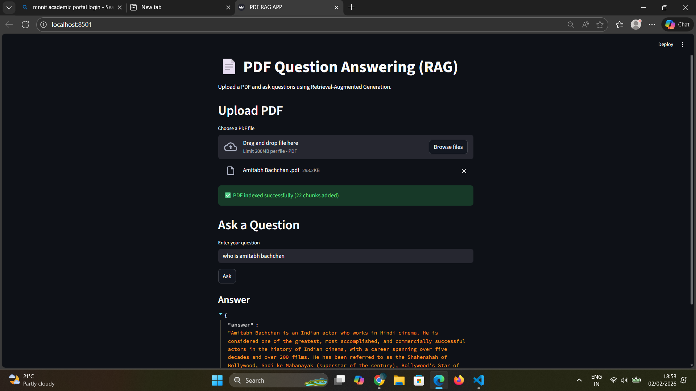
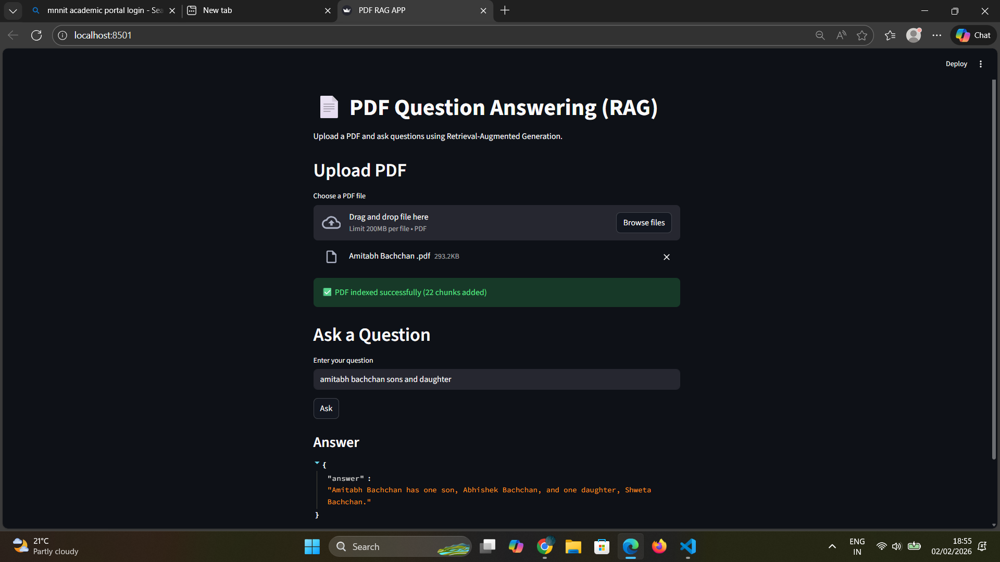

# PDF-Question-Answering-using-RAG

A **Retrieval-Augmented Generation (RAG)** application built with **Streamlit** and **LangChain**.  
It allows users to ask questions about uploaded documents or text, and receive **LLM-generated answers grounded in relevant context**.

---

## Features

- **RAG Backend**
  - Retrieves relevant context from a CHROMA vector store
  - Generates answers using an LLM (OpenAI / ChatGPT)
  - Handles text or PDF documents

- **Streamlit Frontend**
  - User-friendly UI for asking questions
  - Displays AI-generated answers in real-time
  - Supports multiple document uploads

- **Document Ingestion**
  - Chunking and embedding generation using LangChain
  - Persistent vector store for fast retrieval

---

## Tech Stack

- **Backend:** Python, LangChain, Chroma, OpenAI GPT
- **Frontend:** Streamlit
- **Vector Store:** Chroma (local)  
- **Embeddings:** OpenAI Embeddings  

---

### Views

